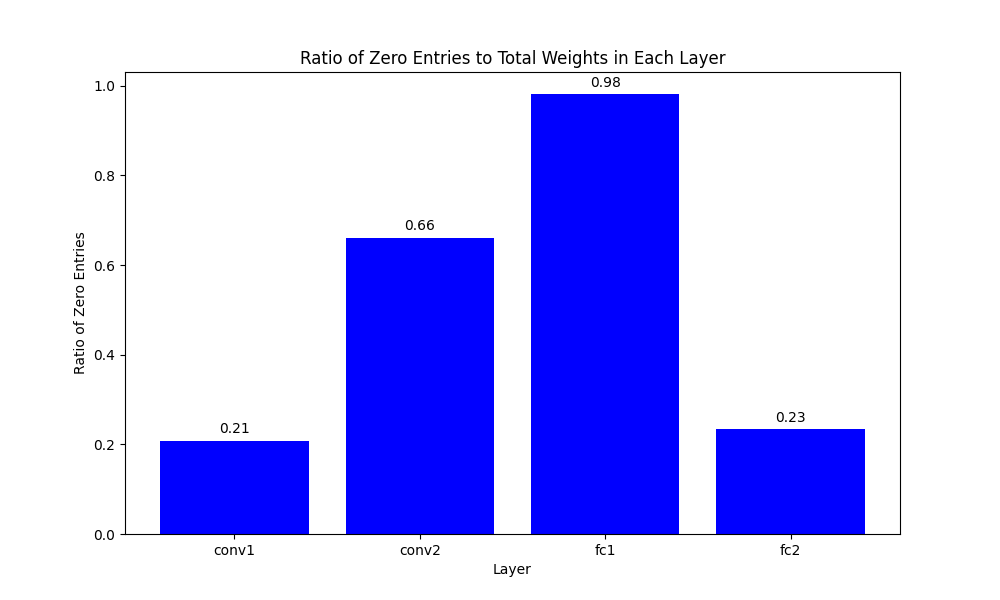

# Research Question: 
Does using a post-training pruning scheme from a model trained on one dataset as a pruning scheme at initialization on the same model architecture but with different training data improve classification accuracy compared to random pruning? 

## Accuracy Results at 97.5% Sparsity

**Note**: Specific pruning was derived from post-training pruning of a model (magnitude-based global pruning) originally trained on MNIST, which had an accuracy of **99%** before pruning, & **96%** after.

| Dataset       | Pruning at Init Accuracy (from MNIST post-training) | Random Pruning at Init Accuracy |
|---------------|------------------------------------------------------|-------------------------|
| MNIST         | 99.23%                                               | 90.19%                  |
| FashionMNIST  | 92.48%                                               | 78.04%                  |

| Dataset       | Pruning at Init Accuracy (from MNIST post-training) | Random Pruning at Init Accuracy |
|---------------|------------------------------------------------------|-------------------------|
| MNIST         | 99.17%                                               | 96.46%                  |
| FashionMNIST  | 92.57%                                               | 88.69%                  |

### 3 epoch

| Dataset       | Pruning at Init Accuracy (from MNIST post-training) | Random Pruning at Init Accuracy |
|---------------|------------------------------------------------------|-------------------------|
| MNIST         | 99.20%                                               | 90.19%                  |
| FashionMNIST  | 92.57%                                               | 78.04%                  |

| Dataset       | Pruning at Init Accuracy (from MNIST post-training) | Random Pruning at Init Accuracy |
|---------------|------------------------------------------------------|-------------------------|
| MNIST         | 99.09%                                               | 96.46%                  |
| FashionMNIST  | 92.40%                                               | 88.69%                  |

## Analysis

### Reusing Pruning Scheme vs Random Pruning
- Pruning at initilization with a specific pruning scheme (derived from post-training pruning) retains higher accuracy compared to random pruning at the same sparsity level.
- This suggests that structured pruning based on learned weights is more effective than random pruning for retaining model performance.

### Cross-Dataset Generalization
- The model retains a reasonable level of performance when applying the MNIST-derived pruning scheme to FashionMNIST, indicating some level of cross-dataset generalization.

